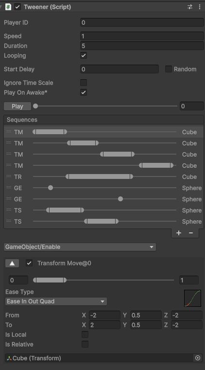

# Tweener



Tweener is a lightweight tween / sequence system for Unity.

It is designed around a small runtime, a simple module architecture, and an editor workflow that keeps sequence setup easy to inspect and preview.

## Features

- Lightweight runtime with minimal per-frame branching
- Sequence-based playback with multiple modules
- Built-in easing with lookup-table sampling
- Inspector timeline editing
- Editor preview support
- Relative and absolute transform animation
- Local and world-space transform animation
- One-shot modules for non-duration actions
- Unity UI Text and TextMeshPro support
- Extensible module architecture through `SequenceModule`

## Built-in Modules

### Transform

- Move
- Rotate
- Scale

### RectTransform

- Move
- Rotate
- Scale
- Size

### Text

- Color — supports Unity UI Text and TextMeshPro
- Size — supports Unity UI Text and TextMeshPro

### Image

- Color

### SpriteRenderer

- Color

### Material

- Color
- Float — shader property name is converted to an ID during initialization
- Vector4 — shader property name is converted to an ID during initialization

### Other

- CanvasGroup Alpha
- GameObject Enable

Additional modules can be implemented by deriving from `SequenceModule`.

## Quick Start

1. Add `Tweener` to a GameObject.
2. Set the sequence duration and playback options.
3. Add modules from the Tweener Inspector.
4. Assign targets and configure each module's start / end timing and values.
5. Enable `Play On Awake`, or control playback from script.

```csharp
public class Example : MonoBehaviour
{
    public Tweener tweener;

    public void Play()
    {
        tweener.Play();
    }
}
```

## Playback API

```csharp
tweener.Play();

tweener.PlayDelayed(0.5f);

tweener.Pause();
tweener.Resume();

tweener.Stop();

tweener.Rewind();
tweener.Complete();

tweener.Evaluate(1.0f);
```

### Playback Behavior

- `Play()` restarts playback from the beginning.
- `PlayDelayed(delay)` restarts playback with an explicit delay.
- `Pause()` pauses the current playback state.
- `Resume()` resumes a paused sequence.
- `Stop()` stops playback while keeping the current evaluated state.
- `Rewind()` stops playback and restores the sequence to its initial state.
- `Complete()` immediately evaluates the sequence at its end time.
- `Evaluate(time)` evaluates the sequence directly at the specified time.

Tweener also supports looping, playback speed, random start delay, and optional unscaled time.

## Module Architecture

Each animation or action is implemented as a `SequenceModule`.

Duration modules evaluate continuously between `startTime` and `endTime`. One-shot modules use `HasDuration == false` and are applied once when their `startTime` is reached.

Modules can cache target state, precompute values, and select their runtime processing delegate during initialization. This keeps the runtime evaluation path small and predictable.

Custom modules can be added by deriving from `SequenceModule` and defining a static `ModulePath`.

## Editor

Tweener includes a custom Unity Inspector for managing sequence modules and their timeline positions.

The editor also supports previewing a sequence without entering Play Mode, making it easier to tune timing, easing, and module values directly in the scene.

## Repository Structure

```text
Tweener.cs
Tweener.EaseFunctions.cs
Tweener.Modules.cs
SequenceModule.cs

DefaultModules/
    Transform/
        TransformMove.cs
        TransformRotate.cs
        TransformScale.cs
    GameObject/
        GameObjectEnable.cs
    UI/
        RectTransform/
            RectTransformMove.cs
            RectTransformRotate.cs
            RectTransformScale.cs
            RectTransformSize.cs
        Text/
            TextColor.cs
            TextSize.cs
        Image/
            ImageColor.cs
        CanvasGroup/
            CanvasGroupAlpha.cs
    SpriteRenderer/
        SpriteColor.cs
    Material/
        MaterialColor.cs
        MaterialFloat.cs
        MaterialVector4.cs

CustomModules/
Editor/
```

## Requirements

- Unity 2019.3 or later
- Uses Unity's `SerializeReference` managed-reference serialization for polymorphic sequence modules
- TextMeshPro package (required by TextColor / TextSize)
